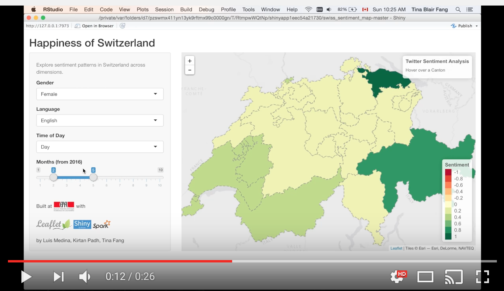
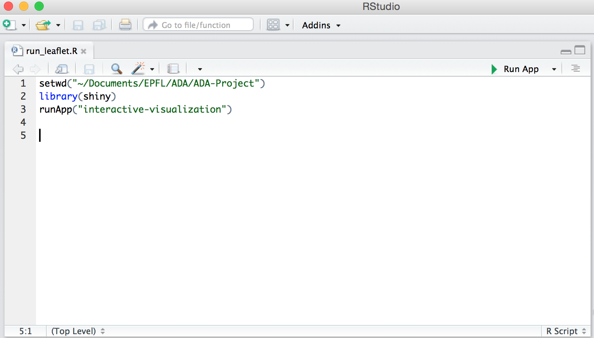
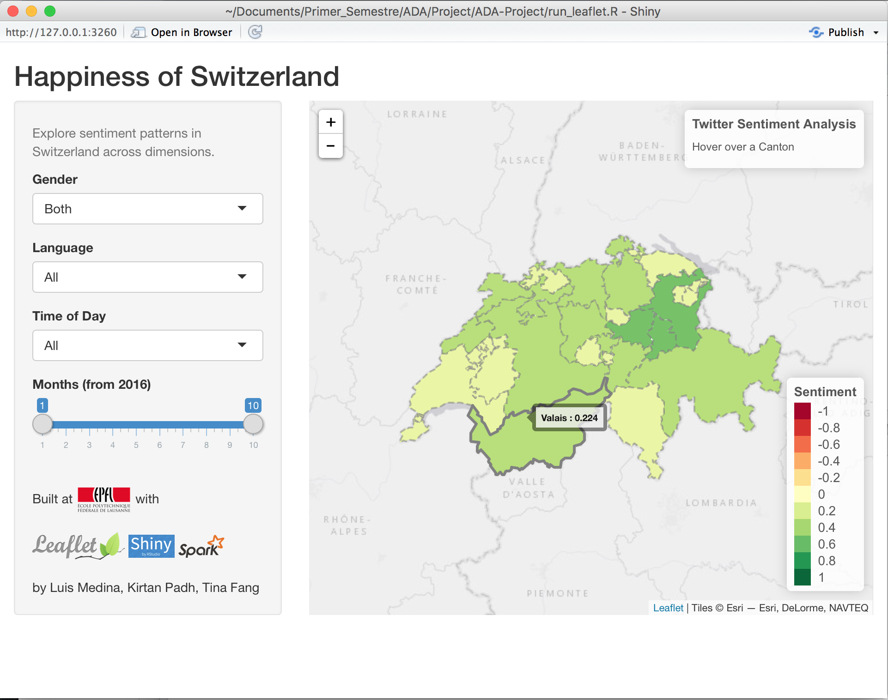
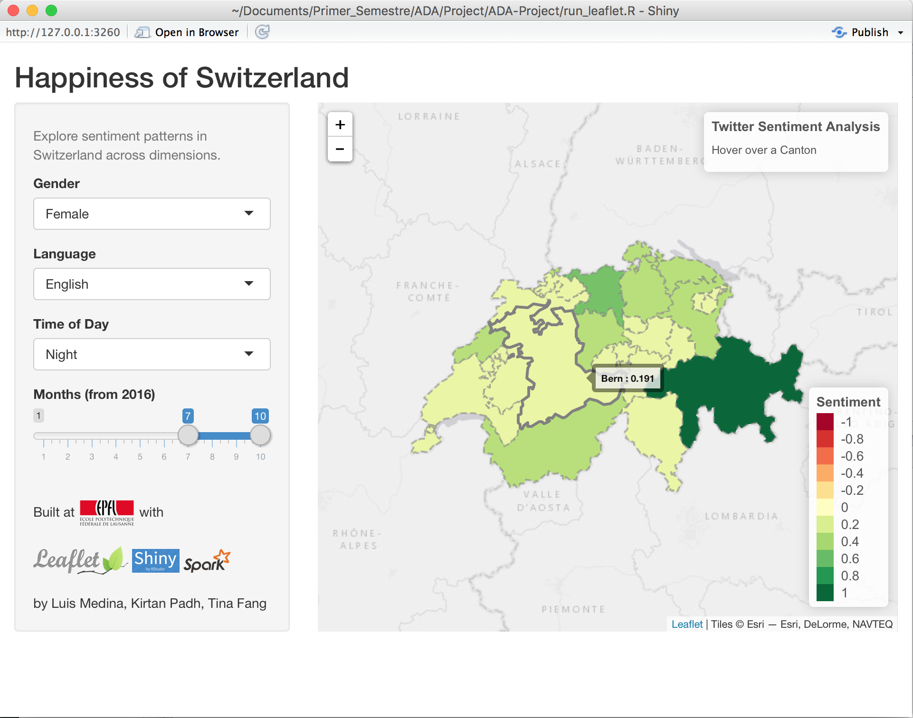

# Swiss Happy Maps

## Result

Interactive Visualization for Twitter Sentiment Across Switzerland. Please check out our video demo:

[](https://www.youtube.com/watch?v=qdTp-QBqTcc)

## Methodology

* Data: `/interactive_visualization/data/twitter.csv`

The raw data from the maps were from Twitter JSON files (55.6GB) in the cluster and the data we used for the visualization was 133KB. Please refer to the Jupyter notebook `/data_wrangling/twitter_cleaning.ipynb` for the full data preparation pipeline.

* Tools: Leaflet and Shiny

We used [Leaflet](https://rstudio.github.io/leaflet) and build the interactive choropleth and [Shiny](https://rstudio.github.io/leaflet) to build the interactive web application. Using an interactive web app framework, we were able to ouput different Leaflet maps according to the user selection.

## Instructions for Running the Map

**NOTE:** Before trying to run the application for displaying the map, please be sure you meet with the following:

* R as well as R Studio have to be installed\*
* The following packets in R need to be also installed (we are writing also the version we used):
  * sp (Classes and Methods for Spatial Data, version 1.2-4)  `install_packages("sp")`
  * rgdal (Bindings for Geospatial Data Abstraction Library, version 1.2-5) `install_packages("rgdal")`
  * shiny (Web Application Framework for R, version 1.0) `install_packages("shiny")`

The simplest way is to run our app from remote source (Github) with following code in RStudio (assuming RStudio and Shiny is installed):

```R
library(shiny)
shiny::runGitHub("swiss_sentiment_map", "tbfang")
```

Alternatively, it is possible to clone the repository, run the app with the following steps:

* Open the `run_leaflet.R` file in R Studio, this file is localized in the root directory of this repository



* Change the directory to the root directory of this repository (where both the `run_leaflet.R` file and the `interactive_visualization` folder are) (go to "Session -> Set Working Directory -> Choose Directory…")


* Press the "Run app" button localizad in the same `run_leaflet.R` pane


After performing the mentioned steps, a new window of R Studio will be displayed showing the application for the interactive map:



Due to the map is interactive, one can change the filters we want to apply for displaying the map such as the gender (male/female/both), language (English, German, French, All), time of the day (Day, Night, All) or select a specific month or a range of months (1 for January, 2 for February and so on until 10 for october). One also can hover over the cantons to see the sentiment value corresponding to it.

**Examples of filters:**
* Gender: Female
* Language: English
* Time of the day: Night
* Months: 7-10 (from july to october)



* Gender: Both
* Language: All
* Time of the day: All
* Months: 5 (May)


\*For more information, please refer to https://www.r-project.org and https://www.rstudio.com
